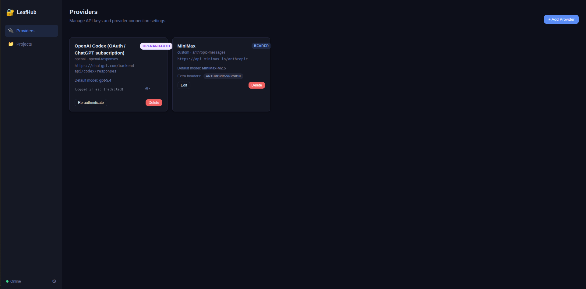
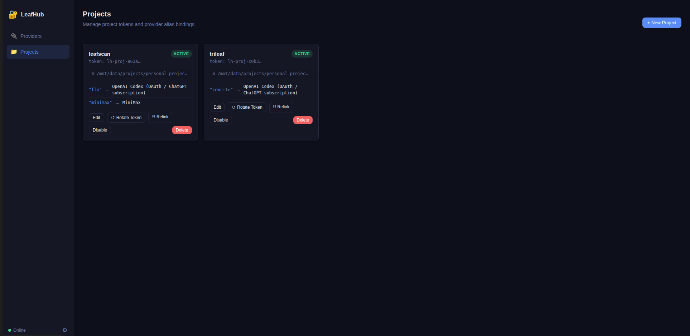

# LeafHub

[](https://github.com/Rebas9512/Leafhub/actions/workflows/ci.yml)
[](LICENSE)
[](https://www.python.org/downloads/)

A local encrypted API key vault for LLM projects. Store provider credentials once, reference them by alias across all your projects — no plaintext keys in `.env` files, no manual copy-paste across repos.

Projects **auto-detect** their credentials on startup via a `.leafhub` dotfile that LeafHub writes when you link a directory. No token management in application code.

## Preview





---

## Install

**macOS / Linux / WSL**

```bash
curl -fsSL https://raw.githubusercontent.com/Rebas9512/Leafhub/main/install.sh | bash
```

**Windows (PowerShell)**

```powershell
irm https://raw.githubusercontent.com/Rebas9512/Leafhub/main/install.ps1 | iex
```

**Windows (CMD)**

```cmd
curl -fsSL https://raw.githubusercontent.com/Rebas9512/Leafhub/main/install.cmd -o install.cmd && install.cmd && del install.cmd
```

The installer prompts for a directory (default: `~/leafhub`), clones the repo, creates a virtual environment, and registers `leafhub` on your PATH. Open a new terminal after install.

---

## Quick setup

**1. Add your first provider**

```bash
leafhub provider add
```

Prompts for provider name, base URL, API key, and default model. Any OpenAI-compatible endpoint works (OpenAI, Anthropic, Groq, Ollama, etc.).

**Or sign in with your ChatGPT subscription (no API key needed):**

```bash
leafhub provider login --name codex
```

Opens a browser for OpenAI OAuth — usage goes through your ChatGPT Plus/Pro quota, not API credits. Tokens auto-refresh on every SDK call.

Or use the Web UI:

```bash
leafhub manage    # opens http://localhost:8765
```

**2. Create a `leafhub.toml` manifest in your project root**

```toml
[project]
name = "my-app"

[[bindings]]
alias = "rewrite"
required = true
env_prefix = "REWRITE"

[env_fallbacks]
rewrite = ["REWRITE_API_KEY", "OPENAI_API_KEY"]
```

**3. Register and bind**

```bash
leafhub register .           # reads leafhub.toml, creates project, binds aliases
leafhub doctor .             # verify all bindings are healthy
```

---

## Using LeafHub in runtime code

Install the lightweight SDK (`pip install leafhub-sdk`) and resolve credentials in one line:

```python
from leafhub_sdk import resolve

# Get credentials (api_key, base_url, model, api_format)
cred = resolve("rewrite")

# Or get a pre-built API client
cred = resolve("rewrite", as_client=True)
client = cred.client  # openai.OpenAI or anthropic.Anthropic

# Or inject as environment variables (for startup-time injection)
env = resolve("rewrite", as_env=True)
os.environ.update(env)  # REWRITE_API_KEY, REWRITE_MODEL, etc.
```

Resolution priority: LeafHub vault → `leafhub.toml` env_fallbacks → common env vars (`OPENAI_API_KEY`, etc.) → actionable error.

The SDK reads `leafhub.toml` for alias, prefix, and fallback configuration — no hardcoded values in application code.

---

## Key rotation and provider switching

Update keys or switch providers any time in the Web UI or CLI — application code requires no changes:

```bash
leafhub manage    # edit providers in the UI
# or CLI:
leafhub project bind my-app --alias rewrite --provider "Anthropic"
```

---

## CLI reference

| Command | What it does |
|---------|-------------|
| `leafhub provider add` | Register a new API provider (API key) |
| `leafhub provider login --name <label>` | Add an OpenAI Codex OAuth provider (ChatGPT subscription) |
| `leafhub provider list` | List configured providers |
| `leafhub register .` | Register project from `leafhub.toml` (manifest mode) |
| `leafhub register <name> --alias <alias>` | Register project with explicit name (legacy mode) |
| `leafhub init .` | Generate `setup.sh` / `install.sh` from `leafhub.toml` |
| `leafhub doctor .` | Validate project integration (token, bindings, env vars) |
| `leafhub project show <name>` | Show project status and bindings |
| `leafhub project bind <name> --alias <alias> --provider <name>` | Bind a provider alias |
| `leafhub manage` | Start the Web UI at http://localhost:8765 |
| `leafhub status` | Overall vault health check |
| `leafhub uninstall` | Full interactive removal |

---

## Uninstall

```bash
leafhub uninstall
```

Interactive two-step removal: removes all project artefacts (`.leafhub`, CLI symlinks), then removes LeafHub itself (`~/.leafhub/`, install directory, PATH entries).

---

## Architecture

```
Manage UI / CLI                  LeafHub                    Your Project
      │                              │                            │
      │  leafhub register .          │                            │
      │  (reads leafhub.toml)        │                            │
      │────────────────────────────► │                            │
      │                              │  write .leafhub (chmod 600)│
      │                              │ ──────────────────────────►│
      │                              │  bind aliases from toml    │
      │                              │                            │
      │                              │     Next startup           │
      │                              │◄───────────────────────────│
      │                              │  leafhub_sdk.resolve()     │
      │                              │  → reads leafhub.toml      │
      │                              │  → reads .leafhub token    │
      │                              │  → decrypts API key        │
      │                              │ ──────────────────────────►│
```

Keys are AES-256-GCM encrypted on disk. The master key lives in the system keychain when available, otherwise in `~/.leafhub/.masterkey`.

### Supported providers

| API format | Auth mode | Examples |
|------------|-----------|----------|
| `openai-completions` | `bearer` | OpenAI, Groq, vLLM, any OpenAI-compatible |
| `openai-responses` | `bearer` / `openai-oauth` | OpenAI Responses API, ChatGPT Codex endpoint |
| `anthropic-messages` | `x-api-key` | Anthropic, MiniMax (Anthropic-compatible) |
| `ollama` | `none` | Local Ollama instance |

OAuth providers (`openai-oauth`) store a refresh token instead of a static API key. The SDK transparently refreshes access tokens on every call — application code sees a standard Bearer token.

### What gets installed

| Location | Contents |
|---|---|
| `~/leafhub/` | Source code (configurable via `LEAFHUB_DIR`) |
| `~/leafhub/.venv/` | Isolated Python environment |
| `~/.local/bin/leafhub` | CLI symlink (macOS / Linux / WSL) |
| `~/.leafhub/` | Encrypted key store, SQLite DB, master key |

---

## Project integration standard

New projects integrate with LeafHub in three steps:

**1. Create `leafhub.toml`** in your project root (commit to git):

```toml
[project]
name = "my-project"
python = ">=3.10"

[[bindings]]
alias = "llm"
required = true
env_prefix = "LLM"
capabilities = ["chat"]

[setup]
extra_deps = []                           # e.g. ["playwright install chromium"]
post_register = []                        # e.g. ["python -m download_models"]
doctor_cmd = "python check_env.py"        # optional health check

[env_fallbacks]
llm = ["LLM_API_KEY", "OPENAI_API_KEY"]   # env var fallback chain
```

**2. Generate setup scripts and register:**

```bash
leafhub init .            # generates setup.sh + install.sh from leafhub.toml
leafhub register .        # creates project, binds aliases from leafhub.toml
leafhub doctor .          # validates token, bindings, env fallbacks
```

**3. Use in code** (`pip install leafhub-sdk`):

```python
from leafhub_sdk import resolve

cred = resolve("llm")         # reads leafhub.toml for alias + fallbacks
api_key = cred.api_key         # decrypted from vault, or from env var
```

Also declare the SDK as a pip dependency:

```toml
# pyproject.toml
[project.optional-dependencies]
leafhub = [
    "leafhub @ git+https://github.com/Rebas9512/Leafhub.git",
    "leafhub-sdk @ git+https://github.com/Rebas9512/Leafhub.git#subdirectory=sdk-pkg",
]
```

**Alias consistency** is enforced by `leafhub.toml` — the manifest is the single source of truth for alias names. No hardcoded strings in application code.

---

## Module reference

### `src/leafhub/`

| File | Responsibility |
|------|----------------|
| `cli.py` | CLI entry point. Subcommands: `provider`, `project`, `register`, `init`, `doctor`, `manage`, `status`. |
| `sdk.py` | Runtime key access. `get_key()`, `get_config()`, `from_directory()`. |
| `probe.py` | Stdlib-only auto-detection. `detect()` finds `.leafhub` and returns `open_sdk()`. |
| `errors.py` | Typed exceptions: `LeafHubError`, `InvalidTokenError`, `AliasNotBoundError`, etc. |
| `scaffold/` | Script generators. `generate_setup_sh()`, `generate_install_sh()` from `leafhub.toml`. |

### `src/leafhub/core/`

| File | Responsibility |
|------|----------------|
| `db.py` | SQLite connection, schema migrations, WAL mode. |
| `crypto.py` | AES-256-GCM encryption. PBKDF2-SHA256 key derivation (600,000 iterations). |
| `store.py` | CRUD operations for providers, projects, tokens, and alias bindings. |
| `oauth.py` | OpenAI Codex OAuth 2.0 Authorization Code + PKCE flow. Token exchange and refresh. |

### `src/leafhub/manage/` (optional — `pip install 'leafhub[manage]'`)

| File | Responsibility |
|------|----------------|
| `server.py` | FastAPI app. Serves the compiled Vue UI from `ui/dist/`. |
| `auth.py` | Admin token middleware with per-IP rate limiting. |
| `providers.py` | Provider CRUD. Connectivity probe on create. OAuth PKCE flow endpoints. |
| `projects.py` | Project CRUD. Token lifecycle, `.leafhub` distribution, CLI auto-registration, full cleanup on delete. |

### `sdk-pkg/leafhub_sdk/` (lightweight SDK — `pip install leafhub-sdk`)

| File | Responsibility |
|------|----------------|
| `probe.py` | Stdlib-only auto-detection. `detect()` finds `.leafhub`, returns `ProbeResult`. |
| `manifest.py` | Parse `leafhub.toml` manifests. `load_manifest()`, `get_default_alias()`. |
| `resolve.py` | Unified credential resolution. `resolve(alias, as_env, as_client)`. |
